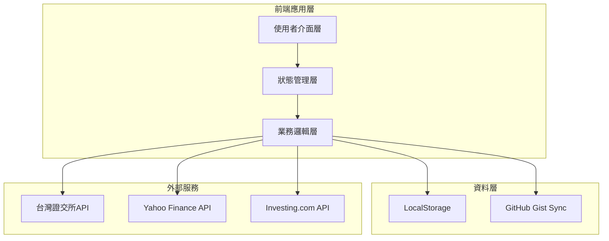
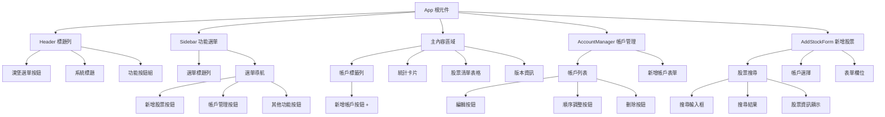
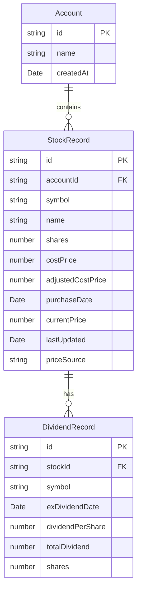

# Stock Portfolio System 設計文件

## 概述

Stock Portfolio System 是一個基於 Web 的股票投資組合管理應用程式，採用單頁應用（SPA）架構。系統使用純 JavaScript（或 TypeScript）配合現代前端框架（建議使用 React 或 Vue.js）開發，提供響應式使用者介面，支援跨裝置使用。

核心功能包括：
- 多帳戶股票投資組合管理
- 即時股價更新（整合台灣證交所API）
- 股息追蹤與成本價調整
- 投資績效計算與視覺化
- 本地儲存與雲端同步（GitHub Gist）
- 資料匯入匯出（JSON/CSV/Excel）

## 最新開發進展（v1.0.0.0056）

### 重要功能更新

#### 1. 操作選單系統重新設計
- ✅ **右上角浮動卡片式設計**：完全按照用戶需求重新設計操作選單
- ✅ **全屏覆蓋模式**：點擊操作按鈕時顯示半透明背景遮罩
- ✅ **固定位置選單**：選單固定在右上角位置（top-16 right-4）
- ✅ **彩色圖示設計**：
  - 藍色：更新股價功能
  - 橙色：購買歷史功能
  - 綠色：股息記錄功能
  - 紅色：刪除功能
- ✅ **點擊外部關閉**：點擊遮罩區域自動關閉選單

#### 2. 股息計算邏輯優化
- ✅ **動態股息計算**：改為根據當前股數×每股股息重新計算總股息
- ✅ **即時更新**：持股數變更時股息金額自動重新計算
- ✅ **配息記錄顯示**：在股息欄位顯示配息次數資訊

#### 3. 後端API服務完善
- ✅ **股票名稱修復**：在後端添加00919的中文名稱對照
- ✅ **ETF格式支援**：支援6位數字+字母格式（00981A、00679B等）
- ✅ **API整合**：前端操作選單的更新股價功能整合後端API

#### 4. UI設計改進
- ✅ **表頭優化**：移除無功能的鉛筆圖示
- ✅ **視覺平衡**：確保操作選單的視覺設計符合深色主題
- ✅ **響應式適配**：選單在不同螢幕尺寸下的正確顯示

### 技術架構更新

#### 前端架構
- ✅ **React 18 + TypeScript**：使用現代React功能
- ✅ **Zustand狀態管理**：輕量級狀態管理解決方案
- ✅ **Tailwind CSS**：深色主題設計系統
- ✅ **響應式設計**：支援手機和桌面裝置

#### 後端架構
- ✅ **Node.js + Express**：RESTful API服務
- ✅ **Yahoo Finance整合**：主要股價資料來源
- ✅ **本地對照表**：備用資料來源和中文名稱支援
- ✅ **資料快取**：1分鐘快取機制提升效能

#### 資料管理
- ✅ **localStorage持久化**：版本化儲存（v5）
- ✅ **測試資料預載**：00878和00919的完整配息記錄
- ✅ **動態計算**：股息、市值、損益的即時計算

### 待實現功能

#### 高優先級
- [ ] **股價更新功能**：批次更新所有股票價格
- [ ] **股息管理介面**：完整的股息記錄管理功能
- [ ] **購買歷史功能**：股票購買記錄管理

#### 中優先級
- [ ] **資料匯入匯出**：JSON、CSV、Excel格式支援
- [ ] **雲端同步**：GitHub Gist整合
- [ ] **響應式優化**：手機版操作選單優化

#### 低優先級
- [ ] **效能優化**：虛擬滾動、防抖處理
- [ ] **錯誤處理**：完整的錯誤邊界和恢復機制
- [ ] **無障礙設計**：鍵盤導航和螢幕閱讀器支援

## 架構

### 系統架構圖



### 技術棧

**前端框架**：
- React 18+ 或 Vue 3+（建議 React 以獲得更好的生態系統支援）
- TypeScript（提供型別安全）
- Tailwind CSS 或 Material-UI（響應式設計）

**狀態管理**：
- React: Zustand 或 Redux Toolkit
- Vue: Pinia

**資料處理**：
- date-fns 或 dayjs（日期處理）
- xlsx 或 SheetJS（Excel 匯入匯出）
- papaparse（CSV 處理）

**API 請求**：
- axios 或 fetch API
- 實作重試機制和錯誤處理

**儲存方案**：
- LocalStorage API（本地持久化）
- GitHub Gist API（雲端同步）

## UI設計規範

### 深色主題設計系統

**主要色彩配置**：
- **主背景色**：`bg-slate-900` - 深色主背景
- **次要背景色**：`bg-slate-800` - 卡片和側邊欄背景
- **邊框色**：`border-slate-700` - 分隔線和邊框
- **主要文字色**：`text-white` - 標題和重要文字
- **次要文字色**：`text-slate-300` - 一般文字
- **輔助文字色**：`text-slate-400` - 標籤和說明文字
- **淡化文字色**：`text-slate-500` - 版本號等次要資訊

**強調色彩**：
- **成功/正值**：`text-green-400` - 獲利顯示
- **主要操作**：`text-blue-400` - 連結和主要按鈕
- **懸停效果**：`hover:bg-slate-700` - 按鈕懸停背景

### 佈局架構

**滿版面設計**：
- 主內容區域始終佔滿整個視窗
- 側邊選單採用覆蓋式設計，不擠壓主內容
- 使用半透明遮罩（`bg-black bg-opacity-50`）突出選單

**響應式斷點**：
- 使用 Tailwind CSS 自定義斷點
- `mobile`: 最大寬度 767px
- `desktop`: 768px 以上

### Header 設計規範

**結構**：
- 左側：漢堡選單按鈕 + 系統標題
- 右側：功能按鈕組（隱私切換、設定、重新整理）

**樣式規範**：
- 背景：`bg-slate-800`
- 高度：固定高度，適當的內邊距（`px-4 py-3`）
- 按鈕：`hover:bg-slate-700` 懸停效果
- 標題：`text-xl font-bold text-white`，左對齊以保持視覺平衡

**文字對齊優化**：
- 系統標題採用左對齊，與選單按鈕保持適當間距（`space-x-4`）
- 避免置中對齊以防止在不同螢幕尺寸下的視覺不平衡
- 確保標題與功能按鈕之間有足夠的空間分隔

### Sidebar 設計規範

**行為**：
- 固定定位（`fixed`），覆蓋在主內容上
- 寬度：256px（`w-64`）
- 動畫：300ms 滑動過渡效果
- 關閉方式：ESC鍵、點擊遮罩、點擊關閉按鈕

**選單項目**：
- 高度：48px（`h-12`）
- 懸停效果：`hover:bg-slate-700 hover:text-white`
- 圖示：24x24px（`w-5 h-5`），左側對齊
- 文字：左對齊，與圖示間距12px（`mr-3`）

### 統計卡片設計

**佈局**：
- 響應式網格：`grid-cols-1 md:grid-cols-2 lg:grid-cols-4`
- 間距：16px（`gap-4`）
- 內邊距：24px（`p-6`）

**樣式**：
- 背景：`bg-slate-800`
- 邊框：`border border-slate-700`
- 圓角：`rounded-lg`
- 標題：`text-sm font-medium text-slate-400`
- 數值：`text-2xl font-bold`

### 表格設計規範

**結構**：
- 表頭：`bg-slate-900` 深色背景
- 表身：`bg-slate-800` 背景
- 分隔線：`divide-slate-700`

**欄位配置**：
1. 股票代碼
2. 股票名稱  
3. 持股數
4. 成本價
5. 現價
6. 市值
7. 損益率
8. 操作

**文字樣式**：
- 表頭：`text-xs font-medium text-slate-400 uppercase tracking-wider`
- 內容：`text-slate-300`

### 版本資訊顯示

**位置**：頁面底部中央
**樣式**：`text-sm text-slate-500`
**格式**：`Stock Portfolio System v{major}.{minor}.{patch}`
**間距**：與上方內容間距32px（`mt-8`）

### 股票代碼驗證規範

**支援的代碼格式**：
- **4位數字**：2330, 0050（一般上市上櫃股票）
- **4位數字+字母**：1565A（特殊股票，支援後綴A, B, C, P, U, L, R, F, T）
- **5位數字ETF**：00646（ETF基金）
- **6位數字ETF**：006208（較新的ETF格式）
- **6位數字+字母ETF**：00679B, 00981A, 00646L（債券ETF和槓桿ETF）

**驗證邏輯**：
```typescript
interface StockCodeValidator {
  // 驗證股票代碼格式是否有效
  isValidStockSymbol(symbol: string): boolean;
  
  // 取得股票代碼的市場類型
  getMarketType(symbol: string): 'listed' | 'otc' | 'etf' | 'emerging';
  
  // 正規化股票代碼（轉大寫、去空格）
  normalizeSymbol(symbol: string): string;
}
```

**格式驗證規則**：
1. 4位數字格式：`/^\d{4}$/`
2. 4位數字+字母格式：`/^\d{4}[A-Z]$/`（字母限定為A,B,C,P,U,L,R,F,T）
3. 5位數字ETF格式：`/^00\d{3}$/`
4. 6位數字ETF格式：`/^00\d{4}$/`
5. 6位數字+字母ETF格式：`/^00\d{3}[A-Z]$/`

## 元件與介面

### 已實作的核心元件

#### 基礎UI元件（`src/components/ui/`）

**Button元件**：
- 支援多種變體：`primary`, `ghost`, `outline`
- 支援多種尺寸：`sm`, `md`, `lg`
- 深色主題設計，懸停效果
- 完整的無障礙支援（aria-label）

**Input元件**：
- 支援標籤、錯誤訊息顯示
- 深色主題樣式（`bg-slate-700`, `border-slate-600`）
- 焦點狀態管理（`focus:border-blue-500`）
- 支援各種輸入類型（text, number, date等）

**Modal元件**：
- 深色主題設計（`bg-slate-800`, `border-slate-700`）
- ESC鍵關閉功能
- 點擊遮罩關閉
- 焦點管理和滾動鎖定
- 半透明遮罩（`bg-black bg-opacity-50`）

#### 功能元件（`src/components/`）

**Header元件**：
- 漢堡選單按鈕（左側）
- 系統標題（中央）
- 功能按鈕組（右側）：隱私切換、設定、重新整理
- 深色主題（`bg-slate-800`）
- 響應式設計

**Sidebar元件**：
- 覆蓋式設計，不擠壓主內容
- 固定定位（`fixed`），寬度256px
- 滑動動畫（300ms過渡效果）
- 功能選單項目：
  - 新增股票
  - 帳戶管理
  - 股息管理
  - 匯出資料
  - 匯入資料
  - 設定
- ESC鍵、點擊遮罩、點擊關閉按鈕關閉
- 點擊功能項目後自動關閉

**AccountManager元件**：
- 深色主題模態框設計
- 帳戶列表顯示（帳戶名稱、股票數量）
- 即時編輯功能（點擊編輯按鈕進入編輯模式）
- 帳戶順序調整功能：
  - 上下箭頭按鈕
  - 智能禁用（第一個帳戶不能上移，最後一個不能下移）
  - 即時順序更新
- 刪除確認對話框（包含股票時警告）
- 新增帳戶功能
- Enter鍵快速提交，ESC鍵取消編輯

**AddStockForm元件**：
- 深色主題設計，符合截圖風格
- 簡化的股票搜尋：
  - 直接輸入股票代碼（如2330）
  - 自動查詢並顯示股票資訊
  - 綠色勾選標記確認選擇
  - 顯示股價資訊（如：2330 - 台積電 (股價: $1585)）
- 帳戶下拉選單
- 表單欄位：
  - 持股數（數字輸入）
  - 成本價（數字輸入，支援小數）
  - 購買日期（日期選擇器）
- 表單驗證和錯誤提示
- 自動聚焦到搜尋欄位

**StockSearch元件**：
- 即時搜尋功能
- 鍵盤導航支援（上下箭頭、Enter選擇、ESC關閉）
- 搜尋結果顯示：
  - 股票代碼和名稱
  - 即時股價和漲跌幅
  - 市場標示
- 載入指示器
- 無結果提示
- 點擊外部關閉

**StockList元件**：
- 深色主題表格設計
- 響應式表格佈局
- 表頭欄位：股票代碼、股票名稱、持股數、成本價、現價、市值、損益率、股息、操作
- 空狀態顯示（無股票時的友善提示）
- 底部統計資訊（股票數量、總市值、總成本、總損益）
- 支援 overflow 處理，確保在小螢幕上可滾動

**StockRow元件**：
- 股票資訊顯示（代碼、名稱、持股數、成本價、現價、市值、損益率、股息）
- 可編輯欄位：持股數、成本價（使用EditableCell元件）
- 動態股息計算：根據當前股數和每股股息重新計算總股息
- 操作選單：
  - 右上角浮動卡片式設計
  - 包含功能：更新股價、購買歷史、股息記錄、刪除
  - 彩色圖示設計（藍色、橙色、綠色、紅色）
  - 點擊外部關閉，半透明背景遮罩
- 刪除確認對話框整合

**EditableCell元件**：
- 點擊進入編輯模式
- 支援整數和小數輸入
- Enter鍵儲存，ESC鍵取消
- 懸停顯示編輯圖示提示
- 輸入驗證（最小值、最大值）
- 格式化顯示（千分位逗號）

**PortfolioStats元件**：
- 四個統計卡片：總市值、總成本、總損益、股息收入
- 深色主題設計（`bg-slate-800`, `border-slate-700`）
- 響應式網格佈局（1-2-4欄）
- 彩色圖示和強調色
- 隱私模式支援（星號遮罩）
- 空狀態處理（無股票時顯示友善提示）
- 詳細統計：持股檔數、總報酬、平均成本

**PrivacyToggle元件**：
- 隱私模式切換按鈕
- 眼睛圖示（開啟/關閉狀態）
- 懸停效果和過渡動畫
- 整合到Header中

**DeleteConfirmDialog元件**：
- 深色主題確認對話框
- 顯示股票詳細資訊（代碼、名稱、持股數、成本價、現價、市值、損益）
- 警告圖示和訊息
- 取消/確定按鈕
- 使用Modal元件基礎

#### 狀態管理（Zustand Store）

**AppStore（`src/stores/appStore.ts`）**：
- UI狀態管理：
  - 側邊選單開關（`isSidebarOpen`）
  - 帳戶管理模態框（`isAccountManagerOpen`）
  - 新增股票表單（`isAddStockFormOpen`）
- 帳戶資料管理：
  - 當前選中帳戶（`currentAccount`）
  - 帳戶列表（`accounts`）
  - 帳戶操作：新增、更新、刪除、重新排序
- 股票資料管理：
  - 股票記錄列表（`stocks`）
  - 股票操作：新增、更新、刪除
  - 股息記錄整合（`dividendRecords`）
- 隱私模式狀態（`isPrivacyMode`）
- 本地持久化（localStorage）
- 測試資料：
  - ✅ 00878（國泰永續高股息）：1000股，包含3次配息記錄（2025年Q1-Q3）
  - ✅ 00919（群益台灣精選高息）：500股，包含2次配息記錄（2024年6月、12月）
  - ✅ 動態股息計算：根據當前股數×每股股息重新計算總股息
  - ✅ 股息記錄查看功能整合到操作選單

#### 後端API服務

**股價查詢API（Node.js + Express）**：
- ✅ 端口：3001
- ✅ 支援的股票代碼：台灣上市上櫃股票和ETF
- ✅ API端點：
  - `GET /api/stock/:symbol` - 獲取單一股票價格
  - `GET /api/search/:query` - 搜尋股票
  - `GET /health` - 健康檢查
- ✅ 資料來源優先順序：
  1. Yahoo Finance API（主要）
  2. 本地股票對照表（備用）
- ✅ 股票名稱對照表：
  - 主要上市股票（台積電、鴻海、聯發科等）
  - 金融股（富邦金、國泰金等）
  - ETF（元大台灣50、國泰永續高股息、群益台灣精選高息等）
  - 支援6位數字+字母ETF格式（00981A、00679B、00646L等）
- ✅ 快取機制：1分鐘快取，自動清理過期資料
- ✅ 錯誤處理：404時返回本地對照表資料
- ✅ 整合到前端：StockRow元件的更新股價功能

#### 版本管理系統

**版本號格式**：v1.0.0.0056（四碼版本控制）
- ✅ MAJOR.MINOR.RELEASE.PATCH
- ✅ 當前版本：v1.0.0.0056
- ✅ 版本顯示：頁面底部中央
- ✅ 版本常數：`src/constants/version.ts`
- ✅ 版本比較和相容性檢查功能
- ✅ 自動版本號格式化（四位數PATCH）

**版本更新記錄**：
- v1.0.0.0043：基礎功能實現
- v1.0.0.0056：完全按照用戶截圖重新設計選單 - 右上角浮動卡片式設計

#### 已實現的核心功能

1. **多帳戶股票管理**：
   - ✅ 帳戶創建、重新命名、刪除、排序
   - ✅ 股票新增、編輯、刪除
   - ✅ 帳戶間股票隔離顯示
   - ✅ 帳戶股票數量自動同步

2. **動態股息計算**：
   - ✅ 根據當前股數和每股股息動態計算總股息
   - ✅ 支援多次配息記錄
   - ✅ 股息統計整合到投資組合統計
   - ✅ 測試資料包含00878和00919的配息記錄

3. **即時股價查詢**：
   - ✅ 後端API整合Yahoo Finance（主要來源）
   - ✅ 本地股票對照表（備用來源）
   - ✅ 股票代碼自動查詢和驗證
   - ✅ 支援台灣股票和ETF格式（包含6位數字+字母格式）
   - ✅ 1分鐘資料快取機制

4. **響應式UI設計**：
   - ✅ 深色主題設計系統
   - ✅ 手機和桌面適配
   - ✅ 覆蓋式側邊選單
   - ✅ 右上角浮動卡片式操作選單

5. **隱私保護**：
   - ✅ 隱私模式切換
   - ✅ 金額星號遮罩
   - ✅ 狀態持久化
   - ✅ 預設啟用隱私模式

6. **資料持久化**：
   - ✅ localStorage自動儲存
   - ✅ 版本化儲存key（v5）
   - ✅ 狀態恢復
   - ✅ 測試資料預載

7. **操作選單系統**：
   - ✅ 右上角浮動卡片式設計
   - ✅ 更新股價功能（整合後端API）
   - ✅ 購買歷史功能（預留）
   - ✅ 股息記錄查看功能
   - ✅ 刪除功能（含確認對話框）
   - ✅ 點擊外部關閉功能
   - ✅ 彩色圖示設計

8. **投資組合統計**：
   - ✅ 四個統計卡片（總市值、總成本、總損益、股息收入）
   - ✅ 詳細統計（持股檔數、總報酬、平均成本）
   - ✅ 空狀態友善提示
   - ✅ 隱私模式支援
   - ✅ 帳戶切換時統計更新

9. **版本管理系統**：
   - ✅ 四碼版本控制（v1.0.0.0056）
   - ✅ 版本常數管理
   - ✅ 頁面底部版本顯示
   - ✅ 版本比較和相容性檢查功能

#### 測試覆蓋

**已實現的測試**：
- 元件單元測試（React Testing Library）
- 屬性基礎測試（fast-check）
- UI互動測試
- 狀態管理測試

**測試框架**：
- Vitest（測試執行器）
- React Testing Library（元件測試）
- fast-check（屬性基礎測試）
- jsdom（測試環境）

### 核心元件架構



### 主要介面定義

#### StockRecord 介面
```typescript
interface StockRecord {
  id: string;                    // 唯一識別碼
  accountId: string;             // 所屬帳戶ID
  symbol: string;                // 股票代碼
  name: string;                  // 股票名稱
  shares: number;                // 持股數
  costPrice: number;             // 原始成本價
  adjustedCostPrice: number;     // 調整成本價（扣除股息）
  purchaseDate: Date;            // 購買日期
  currentPrice: number;          // 現價
  lastUpdated: Date;             // 最後更新時間
  priceSource: 'TWSE' | 'Yahoo' | 'Investing'; // 價格來源
}
```

#### Account 介面
```typescript
interface Account {
  id: string;                    // 帳戶ID
  name: string;                  // 帳戶名稱
  stockCount: number;            // 股票數量（用於UI顯示）
  createdAt?: Date;              // 建立時間
}
```

#### StockSearchResult 介面
```typescript
interface StockSearchResult {
  symbol: string;                // 股票代碼
  name: string;                  // 股票名稱
  market: string;                // 市場標示
  price?: number;                // 股價
  change?: number;               // 漲跌金額
  changePercent?: number;        // 漲跌百分比
}
```

#### StockFormData 介面
```typescript
interface StockFormData {
  symbol: string;                // 股票代碼
  name: string;                  // 股票名稱
  price: number;                 // 股價
  shares: string;                // 持股數（字串形式用於表單）
  costPrice: string;             // 成本價（字串形式用於表單）
  purchaseDate: string;          // 購買日期（ISO字串）
  account: string;               // 所屬帳戶
}
```

#### 元件Props介面

**AccountManagerProps**：
```typescript
interface AccountManagerProps {
  isOpen: boolean;
  onClose: () => void;
  accounts: Account[];
  onCreateAccount: (name: string) => void;
  onDeleteAccount: (id: string) => void;
  onRenameAccount: (id: string, newName: string) => void;
  onReorderAccount: (fromIndex: number, toIndex: number) => void;
}
```

**AddStockFormProps**：
```typescript
interface AddStockFormProps {
  isOpen: boolean;
  onClose: () => void;
  onSubmit: (stockData: StockFormData) => void;
  currentAccount: string;
}
```

**SidebarProps**：
```typescript
interface SidebarProps {
  isOpen: boolean;
  onClose: () => void;
  onOpenAccountManager: () => void;
  onOpenAddStock: () => void;
}
```

### API 服務介面

#### StockPriceService
```typescript
interface StockPriceService {
  // 獲取單一股票價格
  getStockPrice(symbol: string): Promise<StockPrice>;
  
  // 批次獲取多支股票價格
  getBatchStockPrices(symbols: string[]): Promise<Map<string, StockPrice>>;
  
  // 獲取股票名稱
  getStockName(symbol: string): Promise<string>;
}

interface StockPrice {
  symbol: string;
  price: number;
  change: number;
  changePercent: number;
  timestamp: Date;
  source: 'TWSE' | 'Yahoo' | 'Investing';
}
```

#### StorageService
```typescript
interface StorageService {
  // 儲存資料到 LocalStorage
  saveToLocal(data: AppData): void;
  
  // 從 LocalStorage 讀取資料
  loadFromLocal(): AppData | null;
  
  // 同步到 GitHub Gist
  syncToCloud(data: AppData, token: string): Promise<void>;
  
  // 從 GitHub Gist 讀取
  loadFromCloud(token: string): Promise<AppData>;
}

interface AppData {
  accounts: Account[];
  dividends: DividendRecord[];
  settings: UserSettings;
  lastModified: Date;
}
```

#### ImportExportService
```typescript
interface ImportExportService {
  // 匯出為 JSON
  exportToJSON(accounts: Account[], selectedAccountId?: string): string;
  
  // 匯出為 CSV
  exportToCSV(accounts: Account[], selectedAccountId?: string): string;
  
  // 匯出為 Excel
  exportToExcel(accounts: Account[], selectedAccountId?: string): Blob;
  
  // 從檔案匯入
  importFromFile(file: File): Promise<ImportResult>;
}

interface ImportResult {
  success: boolean;
  accounts: Account[];
  conflicts: ConflictInfo[];
  errors: string[];
}
```

## 資料模型

### 資料關係圖



### 資料驗證規則

**StockRecord 驗證**：
- symbol: 必填，4-6位數字或字母
- name: 必填，最多50字元
- shares: 必填，正整數
- costPrice: 必填，正數，最多2位小數
- purchaseDate: 必填，不可晚於今日

**Account 驗證**：
- name: 必填，1-30字元，不可重複

**DividendRecord 驗證**：
- dividendPerShare: 必填，正數，最多4位小數
- exDividendDate: 必填，不可晚於今日
- shares: 必填，正整數

## 正確性屬性

*屬性是指在系統所有有效執行中都應該成立的特徵或行為——本質上是關於系統應該做什麼的正式陳述。屬性作為人類可讀規範和機器可驗證正確性保證之間的橋樑。*

### 股票投資組合管理屬性

**Property 1: 股票記錄創建完整性**
*對於任何*有效的股票輸入資料（代碼、名稱、持股數、成本價、購買日期），當創建新股票記錄時，該記錄應該存在於指定帳戶中，且所有欄位值應與輸入一致
**驗證需求: Requirements 1.1**

**Property 2: 股票代碼自動查詢**
*對於任何*4位數以上的有效股票代碼，當輸入該代碼時，系統應該自動填入對應的股票名稱
**驗證需求: Requirements 1.2**

**Property 3: 刪除操作的不變性**
*對於任何*股票記錄，當執行刪除並確認後，該記錄不應再存在於帳戶的股票清單中
**驗證需求: Requirements 1.3**

**Property 4: 即時編輯功能可用性**
*對於任何*股票記錄，當點擊持股數或成本價欄位時，該欄位應進入可編輯狀態
**驗證需求: Requirements 1.4**

**Property 5: 重複股票處理**
*對於任何*帳戶，當新增已存在的股票代碼時，系統應顯示合併或建立獨立記錄的選項對話框
**驗證需求: Requirements 1.5**

### 多帳戶管理屬性

**Property 6: 帳戶創建**
*對於任何*有效的帳戶名稱，當創建新帳戶時，該帳戶應出現在帳戶清單中
**驗證需求: Requirements 2.2**

**Property 7: 帳戶刪除保護**
*對於任何*包含股票記錄的帳戶，當嘗試刪除時，系統應顯示警告訊息
**驗證需求: Requirements 2.3**

**Property 8: 帳戶重新命名一致性**
*對於任何*帳戶，當重新命名後，該帳戶下所有股票記錄的accountId應保持正確關聯
**驗證需求: Requirements 2.4**

**Property 9: 帳戶切換正確性**
*對於任何*帳戶，當切換到該帳戶時，顯示的股票清單應只包含該帳戶的股票記錄
**驗證需求: Requirements 2.5**

### 股價更新屬性

**Property 10: API容錯機制**
*對於任何*股票，當證交所API失敗時，系統應嘗試備用API（Yahoo Finance或Investing.com）
**驗證需求: Requirements 3.2, 3.5**

**Property 11: 股價更新完整性**
*對於任何*成功的API回應，股票記錄的現價、資料來源和最後更新時間應被正確更新
**驗證需求: Requirements 3.3**

**Property 12: 批次更新**
*對於任何*股票清單，當執行全域更新時，所有股票的價格應被更新
**驗證需求: Requirements 3.4**

### 股息管理屬性

**Property 13: 歷史股息計算**
*對於任何*股票和購買日期，系統計算的歷史股息應只包含購買日期之後的除息記錄
**驗證需求: Requirements 4.1, 4.2**

**Property 14: 股息記錄與成本價調整**
*對於任何*新增的股息記錄，調整成本價應被重新計算並更新
**驗證需求: Requirements 4.3**

**Property 15: 成本價調整公式**
*對於任何*股票，調整成本價應等於原始成本價減去每股累計股息（adjustedCostPrice = costPrice - totalDividendPerShare）
**驗證需求: Requirements 4.4**

**Property 16: 股息統計計算**
*對於任何*股息記錄集合，總股息收入應等於所有股息記錄的總和
**驗證需求: Requirements 4.5**

### 投資績效計算屬性

**Property 17: 市值與損益計算**
*對於任何*股票記錄，市值應等於持股數乘以現價，損益應等於市值減去（調整成本價乘以持股數）
**驗證需求: Requirements 5.1**

**Property 18: 損益計算基準**
*對於任何*有股息調整的股票，損益計算應使用adjustedCostPrice而非costPrice
**驗證需求: Requirements 5.2**

**Property 19: 總報酬計算**
*對於任何*股票，總報酬應等於資本利得加上股息收入
**驗證需求: Requirements 5.3**

**Property 20: 帳戶統計更新**
*對於任何*帳戶切換操作，顯示的統計資料應反映當前帳戶的數據
**驗證需求: Requirements 5.4**

**Property 21: 響應式績效計算**
*對於任何*股價或持股數的變更，所有相關績效指標應立即重新計算
**驗證需求: Requirements 5.5**

### 隱私保護屬性

**Property 22: 隱私模式切換**
*對於任何*隱私按鈕點擊，總市值的顯示狀態應在顯示和隱藏之間切換
**驗證需求: Requirements 6.2**

**Property 23: 隱私模式顯示**
*對於任何*金額欄位，當啟用隱私模式時，應顯示為星號（******）
**驗證需求: Requirements 6.3**

**Property 24: 隱私提示訊息**
*對於任何*隱私模式切換，應顯示提示訊息並在3秒後自動隱藏
**驗證需求: Requirements 6.4**

**Property 25: 隱私按鈕圖示同步**
*對於任何*隱私模式狀態，按鈕圖示應反映當前狀態（顯示/隱藏）
**驗證需求: Requirements 6.5**

### 響應式UI屬性

**Property 26: 選單展開功能**
*對於任何*選單按鈕點擊，功能選單應展開並顯示所有操作選項
**驗證需求: Requirements 7.2**

**Property 27: 響應式佈局適配**
*對於任何*螢幕尺寸變化，UI應根據裝置類型（手機/桌面）調整佈局
**驗證需求: Requirements 7.3, 7.4**

**Property 28: 響應式斷點**
*對於任何*螢幕寬度小於768px的情況，系統應切換為行動版佈局
**驗證需求: Requirements 7.5**

### 資料儲存與同步屬性

**Property 29: 自動本地儲存**
*對於任何*資料變更操作，資料應自動儲存到LocalStorage
**驗證需求: Requirements 8.1**

**Property 30: 雲端同步啟用**
*對於任何*有效的GitHub Token，設定後應成功啟用雲端同步並創建Gist
**驗證需求: Requirements 8.2**

**Property 31: 自動雲端同步**
*對於任何*資料變更，當雲端同步啟用時，應自動上傳到GitHub Gist
**驗證需求: Requirements 8.3**

**Property 32: 資料衝突處理**
*對於任何*本地與雲端資料衝突的情況，系統應提供選擇保留本地或雲端資料的選項
**驗證需求: Requirements 8.5**

### 錯誤處理屬性

**Property 33: API失敗容錯**
*對於任何*API請求失敗，系統應嘗試備用API，若全部失敗則保持上次價格
**驗證需求: Requirements 9.1**

**Property 34: 輸入驗證**
*對於任何*無效輸入資料，系統應顯示錯誤訊息並阻止提交
**驗證需求: Requirements 9.2**

**Property 35: 錯誤恢復**
*對於任何*JavaScript錯誤，系統應記錄錯誤並嘗試恢復正常運作
**驗證需求: Requirements 9.3**

**Property 36: 儲存空間檢查**
*對於任何*本地儲存空間不足的情況，系統應警告使用者
**驗證需求: Requirements 9.4**

**Property 37: 離線處理**
*對於任何*網路連線中斷，系統應顯示離線狀態並在連線恢復時重試
**驗證需求: Requirements 9.5**

### 效能優化屬性

**Property 38: 批次API請求**
*對於任何*多支股票的價格更新，系統應使用批次請求而非逐一請求
**驗證需求: Requirements 10.2**

**Property 39: 虛擬滾動**
*對於任何*超過50筆的股票記錄，系統應啟用虛擬滾動以維持流暢度
**驗證需求: Requirements 10.4**

**Property 40: 閒置暫停更新**
*對於任何*超過5分鐘無操作的情況，系統應暫停自動股價更新
**驗證需求: Requirements 10.5**

### UI互動屬性

**Property 41: 點擊外部關閉選單**
*對於任何*功能選單外的區域點擊，選單應自動收合
**驗證需求: Requirements 11.1**

**Property 42: 操作完成自動關閉**
*對於任何*功能操作完成（如新增股票），選單應自動隱藏
**驗證需求: Requirements 11.2**

**Property 43: 裝置旋轉適配**
*對於任何*裝置旋轉，介面佈局應自動調整
**驗證需求: Requirements 11.3**

**Property 44: 觸控手勢支援**
*對於任何*觸控裝置，系統應支援滑動手勢收合選單
**驗證需求: Requirements 11.4**

**Property 45: 鍵盤導航**
*對於任何*ESC鍵按下，功能選單應關閉；Tab鍵應在股票清單間導航
**驗證需求: Requirements 11.5**

### 介面設計屬性

**Property 46: 版面空間配置**
*對於任何*主畫面顯示，股票清單和投資組合資訊應佔用至少80%的螢幕空間
**驗證需求: Requirements 12.1**

**Property 47: 模態框焦點管理**
*對於任何*新增股票功能開啟，模態框應顯示且焦點應在股票代碼輸入欄位
**驗證需求: Requirements 12.2**

**Property 48: 即時編輯提示**
*對於任何*可編輯欄位點擊，應進入編輯模式並顯示編輯圖示
**驗證需求: Requirements 12.3**

**Property 49: 載入指示器**
*對於任何*長時間操作，應顯示載入指示器直到操作完成
**驗證需求: Requirements 12.4**

**Property 50: 選單遮罩效果**
*對於任何*功能選單展開，應顯示半透明遮罩
**驗證需求: Requirements 12.5**

### 資料匯入匯出屬性

**Property 51: 匯出範圍選擇**
*對於任何*匯出操作，系統應提供全部帳戶或指定帳戶的選項
**驗證需求: Requirements 13.1**

**Property 52: 帳戶匯出過濾**
*對於任何*特定帳戶匯出，匯出資料應只包含該帳戶的股票記錄
**驗證需求: Requirements 13.2**

**Property 53: 多格式匯出支援**
*對於任何*匯出操作，系統應支援JSON、CSV和Excel三種格式
**驗證需求: Requirements 13.3**

**Property 54: 匯入驗證與預覽**
*對於任何*匯入檔案，系統應驗證格式並顯示預覽
**驗證需求: Requirements 13.4**

**Property 55: 匯入衝突處理**
*對於任何*匯入資料衝突，系統應提供覆蓋、合併或跳過的選項
**驗證需求: Requirements 13.5**

### UI設計改進與代碼驗證屬性

**Property 56: ETF代碼格式識別**
*對於任何*6位數字加字母的ETF代碼（如00981A、00679B），系統應正確識別並查詢對應的ETF資訊
**驗證需求: Requirements 1.3**

**Property 57: 台灣股票代碼格式支援**
*對於任何*有效的台灣股票和ETF代碼格式，輸入欄位應正確支援並通過驗證
**驗證需求: Requirements 14.3**

**Property 58: 特殊ETF格式驗證**
*對於任何*特殊格式的ETF代碼（00981A、00679B、00646L等），系統應正確驗證並處理
**驗證需求: Requirements 14.4**

**Property 59: 多格式代碼驗證**
*對於任何*4位數字、5位數字、6位數字加字母的台灣市場標準格式，股票代碼驗證應全部支援
**驗證需求: Requirements 14.5**


## 錯誤處理

### API錯誤處理策略

**股價API失敗處理**：
1. 主要API（TWSE）失敗 → 嘗試Yahoo Finance
2. Yahoo Finance失敗 → 嘗試Investing.com
3. 所有API失敗 → 保持上次價格，顯示錯誤提示
4. 實作指數退避重試機制（1s, 2s, 4s）

**網路錯誤處理**：
- 檢測網路連線狀態
- 離線時顯示離線指示器
- 連線恢復時自動重試失敗的請求
- 使用請求佇列管理待重試的操作

### 資料驗證錯誤

**輸入驗證**：
- 股票代碼：4-6位數字或字母，必填
- 持股數：正整數，必填
- 成本價：正數，最多2位小數，必填
- 購買日期：有效日期，不可晚於今日
- 帳戶名稱：1-30字元，不可重複

**錯誤訊息格式**：
```typescript
interface ValidationError {
  field: string;
  message: string;
  code: string;
}
```

### 儲存錯誤處理

**LocalStorage錯誤**：
- QuotaExceededError → 警告使用者，建議啟用雲端同步或清理資料
- 序列化錯誤 → 記錄錯誤，嘗試恢復到上一個有效狀態

**GitHub Gist同步錯誤**：
- 401 Unauthorized → 提示Token無效，要求重新設定
- 403 Forbidden → 提示權限不足
- 404 Not Found → 嘗試創建新Gist
- 網路錯誤 → 加入重試佇列

### 應用程式錯誤邊界

**React Error Boundary**：
```typescript
class ErrorBoundary extends React.Component {
  componentDidCatch(error, errorInfo) {
    // 記錄錯誤到console或錯誤追蹤服務
    console.error('Application Error:', error, errorInfo);
    // 顯示友善的錯誤訊息給使用者
    // 嘗試恢復應用程式狀態
  }
}
```

**錯誤恢復策略**：
1. 記錄錯誤詳情
2. 顯示使用者友善的錯誤訊息
3. 提供重試或重新載入選項
4. 保護資料不丟失


## 測試策略

### 雙重測試方法

本系統採用單元測試和屬性基礎測試（Property-Based Testing, PBT）的雙重測試策略：

- **單元測試**：驗證特定範例、邊界情況和錯誤條件
- **屬性測試**：驗證應在所有輸入中成立的通用屬性
- 兩者互補：單元測試捕捉具體錯誤，屬性測試驗證一般正確性

### 屬性基礎測試（PBT）

**測試框架**：fast-check（JavaScript/TypeScript的PBT庫）

**配置要求**：
- 每個屬性測試至少執行100次迭代
- 使用隨機種子以確保可重現性
- 失敗時自動縮小（shrinking）到最小反例

**屬性測試標註格式**：
每個屬性測試必須使用註解明確引用設計文件中的正確性屬性：
```typescript
// **Feature: stock-portfolio-system, Property 1: 股票記錄創建完整性**
test('stock record creation integrity', () => {
  fc.assert(
    fc.property(
      stockDataArbitrary,
      (stockData) => {
        // 測試邏輯
      }
    ),
    { numRuns: 100 }
  );
});
```

**測試生成器（Arbitraries）**：
```typescript
// 股票代碼生成器
const stockSymbolArbitrary = fc.string({ minLength: 4, maxLength: 6 })
  .filter(s => /^[A-Z0-9]+$/.test(s));

// 股票記錄生成器
const stockRecordArbitrary = fc.record({
  symbol: stockSymbolArbitrary,
  name: fc.string({ minLength: 1, maxLength: 50 }),
  shares: fc.integer({ min: 1, max: 1000000 }),
  costPrice: fc.float({ min: 0.01, max: 10000, noNaN: true })
    .map(n => Math.round(n * 100) / 100),
  purchaseDate: fc.date({ max: new Date() })
});

// 帳戶生成器
const accountArbitrary = fc.record({
  name: fc.string({ minLength: 1, maxLength: 30 }),
  stocks: fc.array(stockRecordArbitrary, { maxLength: 50 })
});
```

### 單元測試

**測試框架**：Vitest 或 Jest

**測試範圍**：
- 元件渲染測試（React Testing Library）
- 業務邏輯函數測試
- API服務測試（使用mock）
- 資料驗證測試
- 錯誤處理測試

**範例測試**：
```typescript
describe('StockRecord Validation', () => {
  test('should reject negative share count', () => {
    const invalidStock = { ...validStock, shares: -10 };
    expect(() => validateStockRecord(invalidStock))
      .toThrow('Shares must be positive');
  });
  
  test('should reject future purchase date', () => {
    const futureDate = new Date();
    futureDate.setDate(futureDate.getDate() + 1);
    const invalidStock = { ...validStock, purchaseDate: futureDate };
    expect(() => validateStockRecord(invalidStock))
      .toThrow('Purchase date cannot be in the future');
  });
});
```

### 整合測試

**測試場景**：
- 完整的使用者流程（新增股票 → 更新價格 → 查看績效）
- 資料持久化流程（儲存 → 讀取 → 驗證）
- 雲端同步流程（上傳 → 下載 → 衝突解決）
- API容錯流程（主API失敗 → 備用API成功）

### E2E測試（可選）

**測試工具**：Playwright 或 Cypress

**測試場景**：
- 跨瀏覽器相容性
- 響應式設計驗證
- 完整使用者旅程

### 測試覆蓋率目標

- 核心業務邏輯：90%以上
- UI元件：70%以上
- 整體程式碼：80%以上

### 持續測試

- 每次commit前執行單元測試
- 每次PR前執行完整測試套件
- 使用GitHub Actions進行CI/CD

